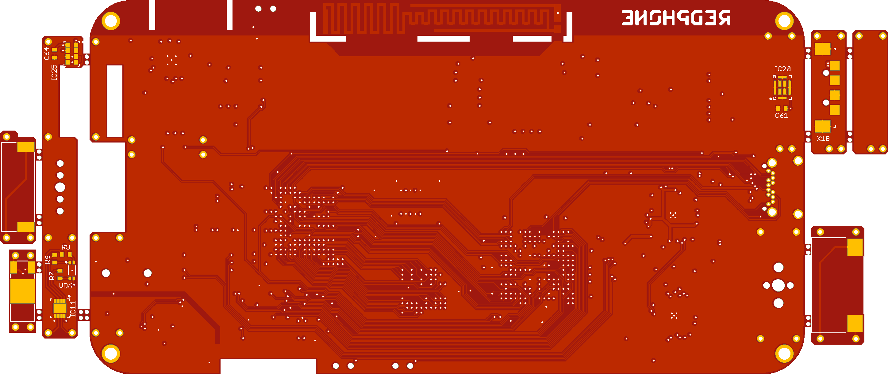

## About
Redphone - simple handmade open source mobile phone

## PCB

## Hardware
* Cortex M4 STM32F429NI
* FPGA EP4CE22U14I7N
* 800x480 LCD on RM68120 controller
* Capasitive LG P715 touch screen
* Memory (two SDRAM MT48LC16M16A2B4, MicroSD)
* Audio system based on (WM8903, MP34DT01 dmic, headphone, ring, minijack)
* Wi-Fi on ESP8266
* GSM & Bluetooth in SIM800H, nanosim (galaxy s8 sim-sd slot)
* Sensors (MPU9250, APDS-9960, BME280)
* GPS MC-1010-G
* OV5647 camera (Raspberry Pi compatible) & led
* Power domain (galaxy s4 battery, TPS65217)
* USB type-C for custom connections

## Software
* Latest linux kernel
* Firmware based on FreeRTOS, lwIP and Graphix (GUI C++ library)
